# 26.02.24 Методы повышения производительности и доступности баз данных через масштабирование на примере PostgreSQL (Репликация, Шардирование, Партиционирование)

## Введение

В современном информационном мире, где базы данных играют ключевую роль в хранении и обработке огромного объема информации, эффективное управление данными становится все более важным. Масштабирование баз данных - это процесс, позволяющий адаптироваться к растущим потребностям и обеспечивать непрерывную работу системы даже при повышенной нагрузке.

Сегодня поговорим про три способа масштабирования БД на примере ___PostgreSQL___.:

* Репликация
* Партиционирование
* Шардирование

Далее будем считать, что ___партиционирование___ происходит в рамках одного сервера, а ___шардирование___ – в распределенной системе из нескольких узлов.

## Репликация

Репликация – это механизм копирования и поддержания в согласовании нескольких ___одинаковых___ наборов данных.

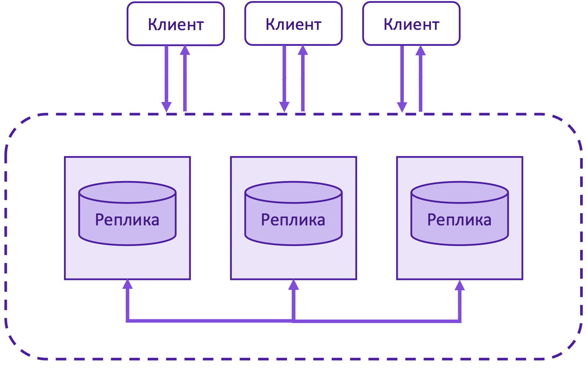

Мотивация:

* Обеспечение долговечности данных (больше одинаковых копий)

* Повышение доступности (при отказе реплики – все еще работаем)

* Увеличение производительности (балансируем запросы между репликами)

Обратите внимание на таблицу ниже. Она показывает зависимость вероятности отказа реплик от их числа, если, допустим, вероятность отказа одной реплики - 0.01.

$$ P_i(j) = P_i(i >= j >= 1)= {i \choose j} * 0.01^j $$

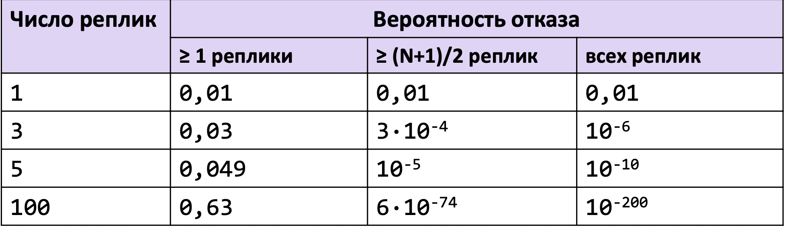

Обычно репликация выдерживает потери нескольких реплик. Можем заметить, что в пределе вероятность отказа бОльшего числа реплик стремительно падает, что позволяет нам строить высоконадежные системы из реплик.

Недостатки:

* Требуется в N раз больше ресурсов для хранения данных

* Необходимо обеспечить согласованность данных

Выделение большого кол-ва ресурсов не столь критично в больших проектах, а обеспечение консистентности данных, напротив, становится узким местом.

Если мы говорми про неизменяемые данные (e.g. аудит, логи), то их репликация реализуется тривиально. Намного сложнее масштабировать работу с изменяемыми данными: нужно синхронизировать реплики и обеспечивать согласованность данных.

Выделяют две архитектурных модели репликации:

* пассивная – один выделенный сервер, обрабатывающий запросы клиентов и передающий изменения остальным

* активная – серверы равноправны, запросы клиентов обрабатываются каждым сервером

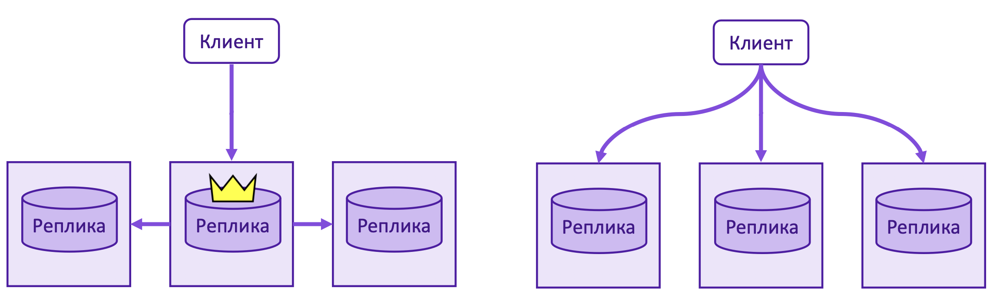

А также два способа реплицировать данные при пассиваной репликации:

* синхронный – когда клиент получает ответ после изменениях данных на всех репликах

* ассинхронный – когда клиент получает ответ после записи на одну из реплик, далее реплики распространяют ответ в фоне

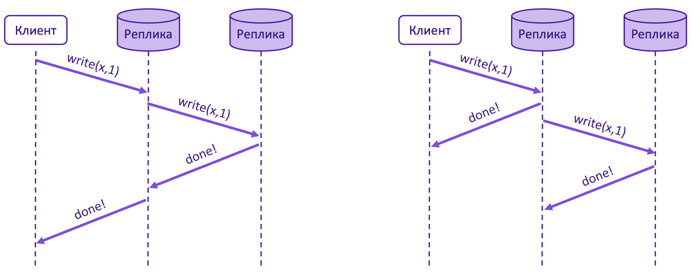

Выделяют еще промежуточный способ репликации – полусинхронный, когда данные синхронно пишутся лишь на часть реплик.

Все архитектурные модели и способы репликации постоянно комбинируются, так как нет серебряной пули для решения всех задач. Поэтому появляются различные подходы.

Основные подходы к репликации:

* Репликация с одним лидером

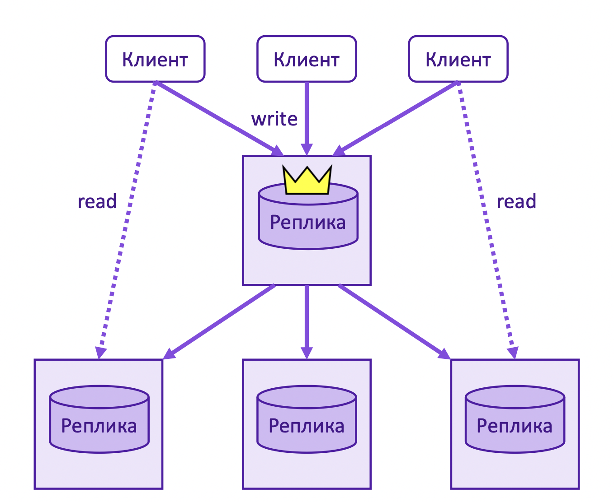

* Репликация с несколькими лидерами

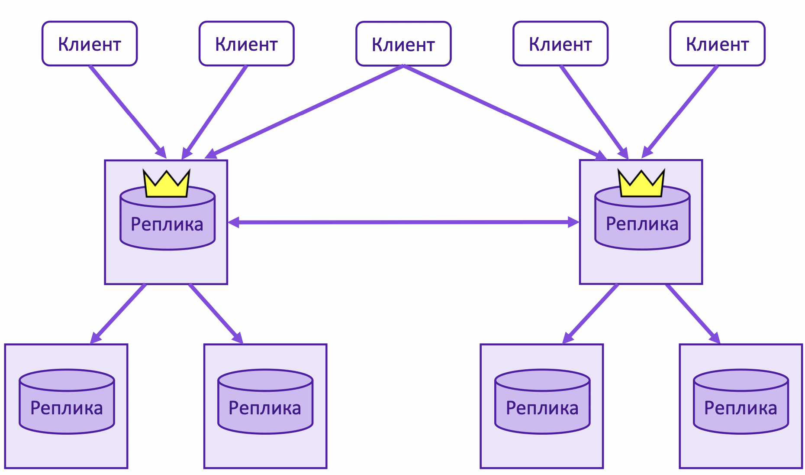

* Репликация без лидеров

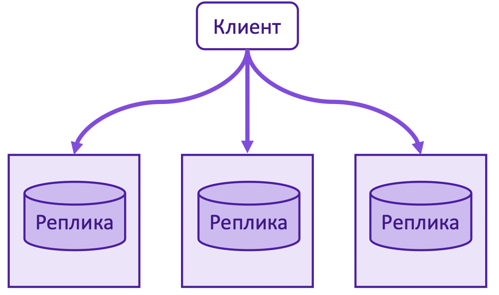

### Репликация на примере PostgreSQL

---
Рассмотрим репликацию с одним лидером из коробки на примере PostgreSQL. Другие подходы к репликации можем встретить в иных системах. Так, например, CouchDB поддерживает multiple leader replication, а Cassandra, вовсе, leaderless.

PostgreSQL поддерживает из коробки логическую и физическую репликацию.

Физическая репликация построена на точных адресах блоков и побайтовом копировании, изменения на репликах передаются через WAL лидера.

Логическая репликация, напротив, не привязана к конкретному представлению данных на диске, а построена на работе с идентификаторами репликации по модели публикация-подписка.

Логическая репликация позволяет более детально управлять репликацией данных и аспектами безопасности.

Ниже можно увидеть архитектуру логической репликации для PostgreSQL 15.

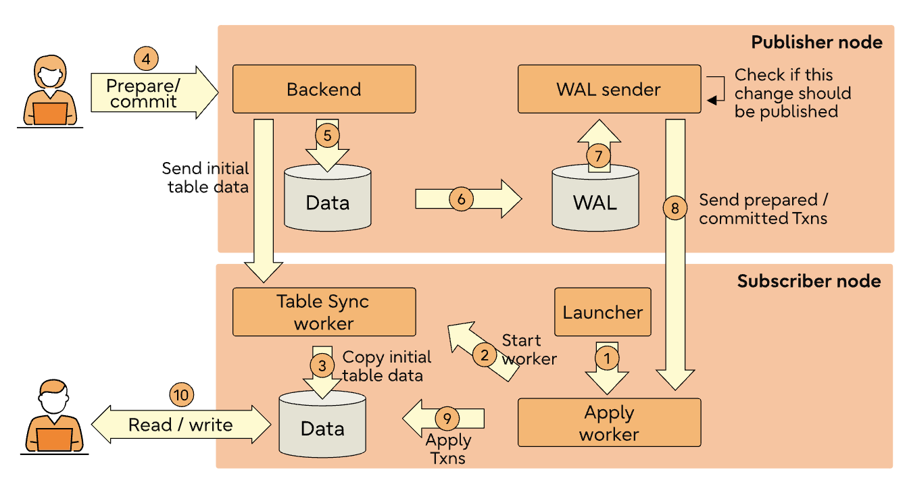

### Логическая репликация на практике

---
Реализуем логическую репликацию на одном хосте с различными портами для лидера и реплики.

В конфигурации ```postgresql.сonf``` достаточно проставить ```wal_level = logical```, что указывают серверу сохранять дополнительную информацию о WAL.

Далее создадим публикацию с лидера, используя следующую команду.

```sql
CREATE PUBLICATION my_pub FOR ALL TABLES;
```

Как только публикация была создана, можно создавать подписки в узле подпсичиков.

```sql
CREATE SUBSCRIPTION my_sub&nbsp;
CONNECTION '<connection string>' PUBLICATION my_pub;
```

Это добавит новую подписку ```my_sub``` для текущей базы данных, которая начнет получать логические изменения из публикации ```my_pub```.

Можете посмотреть функциональность логической репликации подробнее в документации [CREATE PUBLICATION](https://www.postgresql.org/docs/current/sql-createpublication.html) и [CREATE SUBSCRIPTION](https://www.postgresql.org/docs/current/sql-createsubscription.html).

## Партиционирование

Партиционирование – это процесс разделения таблиц или проколлекций документов на отдельные части в рамках ___одного___ сервера.

Каждая партиция, представляет собой отдельную таблицу, в которой хранится подмножество исходных данных. Этот метод может значительно повысить производительность запросов и управления данными для больших наборов данных.

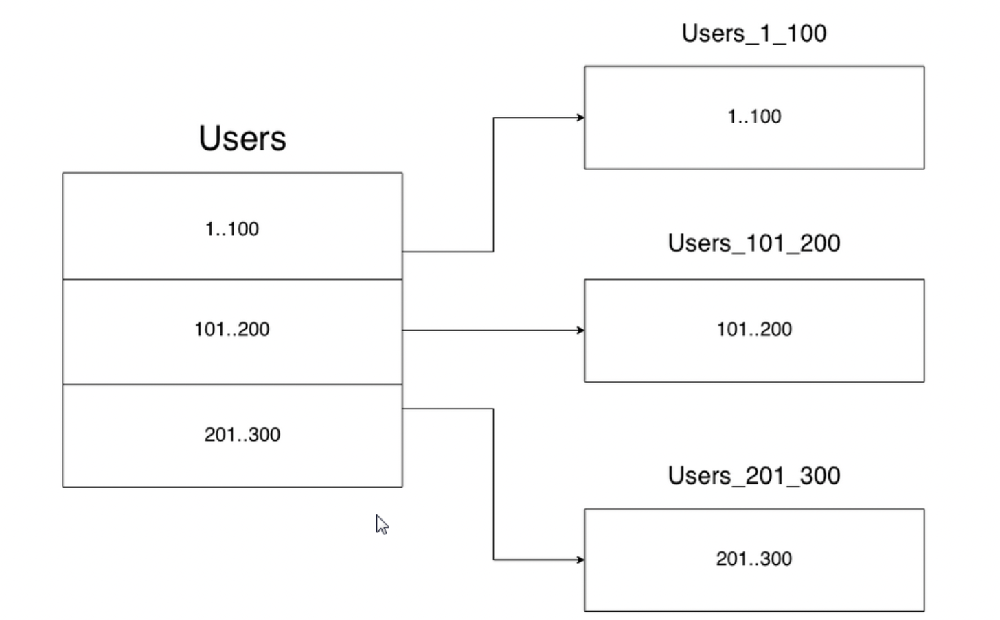

Какие проблемы помогает решить партиционирование?

* ___Улучшенная производительность запросов___: Партиционирование позволяет БД быстро сузить объем данных до определенного раздела, уменьшая объем сканируемых данных.
Партиционирование по сути заменяет верхние уровни деревьев индексов, что увеличивает вероятность нахождения наиболее востребованных частей индексов в памяти.

* ___Упрощенное управление данными___: С помощью разбиения таблиц на разделы можно легко управлять большими наборами данных, разбивая их на более мелкие, более управляемые разделы. Это может упростить такие задачи, как архивирование данных, очистка данных.

* ___Улучшенная загрузка и индексация данных___: При загрузке данных в партиционированную таблицу процесс может быть распараллелен, что приводит к более быстрому получению данных. Кроме того, индексы в таких таблицах могут быть более эффективными, поскольку они должны охватывать только меньшее подмножество данных.

* ___Экономичное хранилище___: Разделение на части позволяет хранить более старые или менее используемые данные на более дешевых носителях, сохраняя при этом часто используемые данные на более быстрых устройствах.

Всё это обычно полезно только для очень больших таблиц. Как правило, следует применять для таблиц, размер которых превышает объём ОЗУ сервера.

Как можно сразу заметить, количество данных не уменьшается и, если неправильно выбирать критреии для разделения на партиции, можно сделать только хуже. Поэтому, если у вас кончается место на накопителе – партиционирование вряд ли поможет.

Чтобы партиционировать одну большую таблицу на несколько менее объемных – необходимо выбрать критерии деления.

Для выбора оптимального критерия необходимо:

* Топ наиболее встречающихся запросов на чтение

* Определить условия выборки данных в этих запросах – получить топ кандидатов-критериев деления таблиц. Следует также смотреть на цели, которых Вы хотите достичь, благодаря партиционированию. Например, для удаления данных лучше подойдет поле `created_at`, а для ускорения выборки – `id`

Также стоит уточнить размеры партиций: кол-во строк, ttl записей и тп. Например, если самый частый запрос делает выборку за последний месяц по критерию `created_at` – имеет смысл сделать размером партиции период в 1 месяц.

Полсе этого, стоит выбрать какое-то множество критериев партиционирования и размеров партиций и протестировать их с возможностью роллбэка.

### Партиционирование через наследование на примере PostgreSQL

---
В PostgreSQL из коробки доступны два подхода к партиционированию: декларативный и через наследование.

___Декларативное партиционирование___ – встроенное и наиболее производительное разделение, но с рядом недостатков: нужно при создании таблицы указывать ее возможность к партиционированию, ограничение на произвольность критериев деления и тп.

___Партиционирование через наследование___ – дает нам более гибкий подход к выбору критерия деления, преимущества множественного наследование, возможность партицировать существующие таблицы и легко откатывать результаты.

Расcмотрим партиционирование через наследование, как более универсальный подход.

1. Пусть у нас есть следующая таблица `post`.

    ```sql
        CREATE TABLE post (
            id bigint not null,
            author character varying not null,
            category_id int not null
        );
    ```

2. Создадим две партиции, поделив условно по id категории поста. Наследованные таблицы будут иметь схему родителя, также могут иметь свои колонки, однако триггеры, индексы и ограничения не сохраняются.

    ```sql
        CREATE TABLE post_1 (
            CHECK (category_id = 1)
        ) INHERITS (post);

        CREATE TABLE post_2 (
            CHECK (category_id = 2)
        ) INHERITS (post);
    ```

3. Далее создадим правила для вставки в соответствующие партиции.

    ```sql
    CREATE RULE post_insert_category_1 AS ON INSERT TO   post 
    WHERE (category_id = 1) 
        DO INSTEAD INSERT INTO post_1 VALUES (NEW.*);

    CREATE RULE post_insert_category_2 AS ON INSERT TO   post 
    WHERE (category_id = 2) 
        DO INSTEAD INSERT INTO post_2 VALUES (NEW.*);
    ```

В целом, партиционирование готово. Можете добавить свои ограничения, индексы и тп, или правила для других DML комманд. Теперь операции вставки в таблицу `post` будут попадать в соответсвующие партиции, а поиск по `category_id` будет производится быстрее (по основной таблице и нужным партициям).

Это лишь примитивная реализация партиционирования, без переливки и удаления данных из master-таблицы, автоматизации через триггеры и тп. Однако она хорошо отражает суть этого метода масштабирования.

___NB___:

* Cтоит параметр `constraint_exclusion`, чтобы запросы не сканировали все партиции.

* Нужно правильно сконфигурировать параметр `max_parallel_workers_per_gather` – кол-во распараллеленных воркеров для сборки результата, чтобы улучшить производительность.

## Шардирование

___Шардирование___ – это процесс разделения таблиц или проколлекций документов на отдельные части в рамках ___нескольких___ серверов.

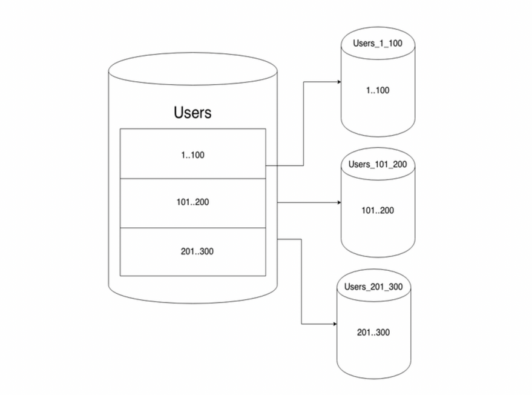

Можно представлять то же партиционирование, но на нескольких физических машинах. Поэтому почти все, что я расскажу в реализации шардирования, применимо и для партиционирования.

Основное преимущество шардирования над партиционированием – возможность распараллелить вычисления на несколько ядер, дисков, машин и тп. Соответственно, увеличиваем ___bandwidth___ и потенциально уменьшаем ___latency___ (таблицу из 1млн записей отсканировать ~ в 10 раз медленее, чем 10 таблиц по 100тыс в параллели).

Но, конечно, шардинг – это не панацея. При большом количестве данных и правильной реализации он, скорее, поможет, однако тут важно заметить – ___правильной___ реализации.

### Закон Амдала

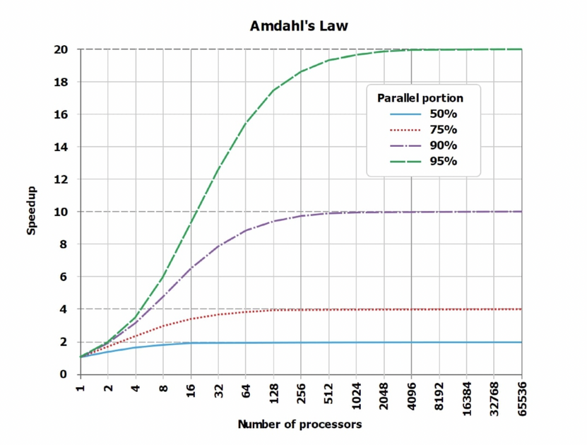

Не стоит забывать, что распараллелить на 100% данные мы не можем: есть serialized часть c долей $\alpha$, которую можно случайно сделать приличной, и вообще замедлить запросы.

$$ S_p = {1 \over \alpha + {1 - \alpha \over p}} $$

Тут $S_p$ – полученное ускорение, $\alpha$ – доля последовательной части, $(1 - \alpha)$ – доля распараллеленной.

Примеры serialized частей:

* Мердж данных из шардов
* ORDER BY и тп

На графике видно, что есть некая асимптота для ускорения при увеличении количества процессоров и доли распараллеливания соответсвенно.

Рассмотрим $number\_of\_cores = 10$, $\alpha = 0.5$ и посмотрим на ожидаемое и теоретическое ускорения.

| number_of_cores | speedup   |   diff   |
|-----------------|-----------|----------|
| 8               | 5.9       | 74%      |
| ___10___        | ___6.9___ | ___69%___|
| 20              | 10.3      | 51%      |
| 40              | 13.6      | 34%      |

Неутешительные результаты: для 10 ядер – получаем 69% от желаемого ускорения, для большего количества еще меньше.

Поэтому важно минимизировать эту последовательную часть. Необходимо делать выборки по ключу и параллелить все запросы, как только можете.

### Функция шардирования

Давайте теперь научимся делить на шарды. Придумаем волшебную функцию, которая будет определять в какой шард класть наш объект. Пробежимся по основным подходам и их минусам, подробнее можете почитать самостоятельно, это не входит в скоуп статьи.

$$Shard = ShardingFunction(ObjectKey)$$

Требования к функции:

* Детерминированность
* Равномерность
* Устойчивость к изменениям состава узлов (rebalancing)

1. $Shard = someReproducibleHash()$

    Неплохая функция, для одной записи идем на один определенный сервер, но для диапазона ключей придется просканировать чуть ли не все шарды.

2. $Shard = date \% num\_shards$ – естественное шардирование.

    Проблема с диапазном решается отчасти, так как решение будет заточено под конкретный кейс и некоторые шарды могут простаивать в зависимости от распределения запросов (например, шарды побили по неделям, и, вероятность, что запрос попадет в последние недели – последний шард, намного выше).

Есть еще куча разных вариантов функций, я лишь осветил базовые подходы, вы можете придумать критерий деления сами, учитывая требования и аналитику запросов.

После выбора функции шардирования нужно:

* сделать распределение данных равномерным
* научиться решардить при увеличении данных, изменении требований и тп. (Consistent Hashing, HRW и тп, это выходит за скоуп статьи).

Для большого количества NewSQL и NoSQL решений достаточно подкрутить настройки и выставить $number_of_shards$, посмотрим шардинг на примере объектно-реляционной PostgreSQL.

### Шардирование через наследование на примере PostgreSQL

1. Пусть у нас есть следующая таблица `post` – шард с `category_id=1`.

    ```sql
        CREATE TABLE post (
            id bigint not null,
            author character varying not null,
            category_id int not null
            CONSTRAINT category_id_check CHECK (category_id_check)
        );
    ```

2. Подключаем `EXTENSION` `postgres_fdw` из коробки для настройки шардинга, заводим удаленный сервер и создаем маппинг для пользователя.

    ```sql
       CREATE EXTENSIONS potgres_fdw;

       CREATE SERVER post_1_server;
       FOREIGN DATA WRAPPER potgres_fdw;
       OPTIONS (host '127.0.0.1', port '5432', dbname 'post_1');

       CREATE USER MAPPING FOR postgres
       SERVER post_1_server
       OPTIONS (user 'postgres', password 'postgres');
    ```

3. Заводим таблицу на основном сервере. Также поступаем с другой таблицей.

    ```sql
        CREATE TABLE post_1 (
            id bigint not null,
            author character varying not null,
            category_id int not null
            CONSTRAINT category_id_check CHECK (category_id_check)
        )
        SERVER post_1_server
        OPTIONS (schema_name 'public', table_name 'post');
    ```

4. Далее заводим основную таблицу.

     ```sql
        CREATE VIEW post AS
            SELECT * FROM post_1
                UNION ALL
            SELECT * FROM post_2;a
    ```

5. Добавляем правила, как в партиционировании и проверяем.

## Вывод

Перед выбором варианта масштабирования тщательно анализируйте проблему и ознакамливайтесь со всеми преимуществами и недостатками подходов.
