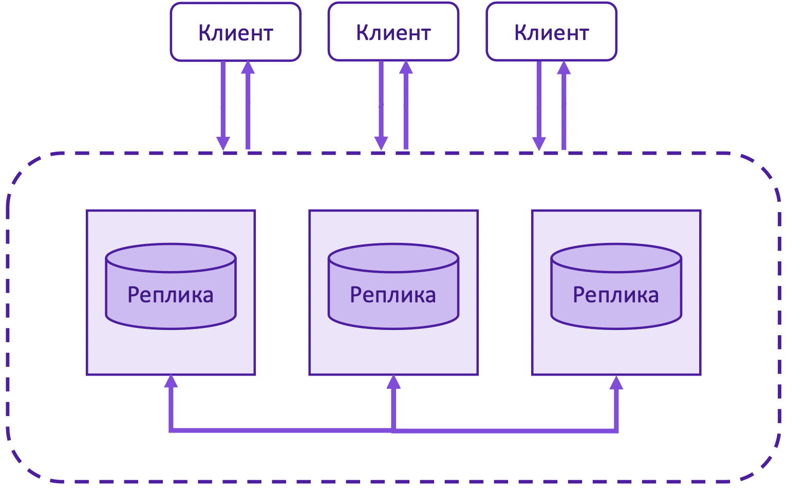
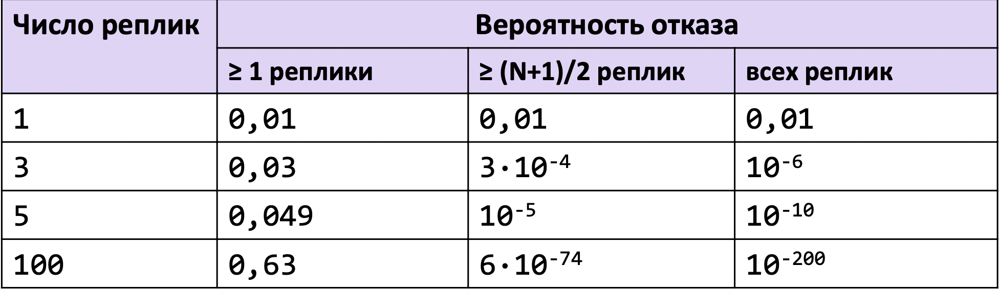
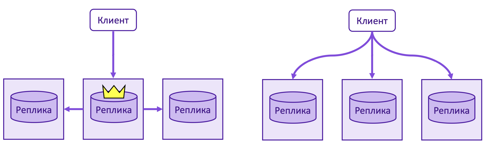
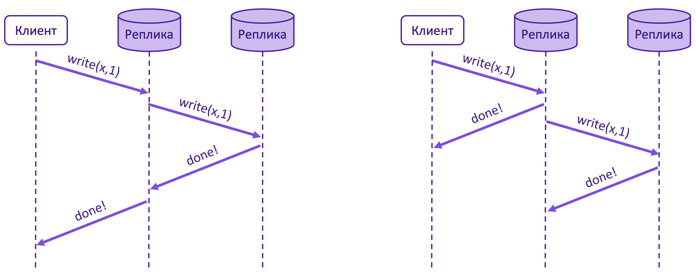
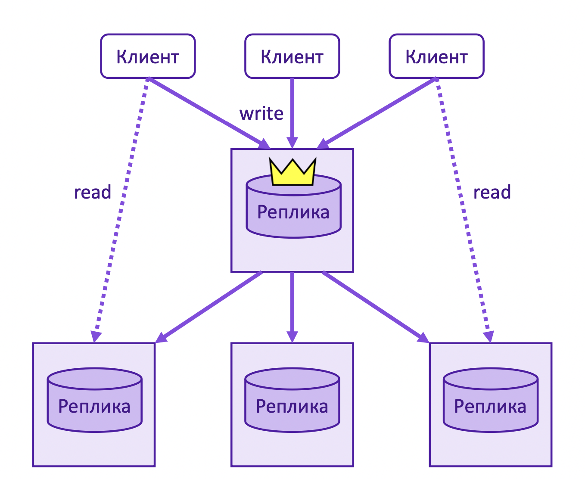
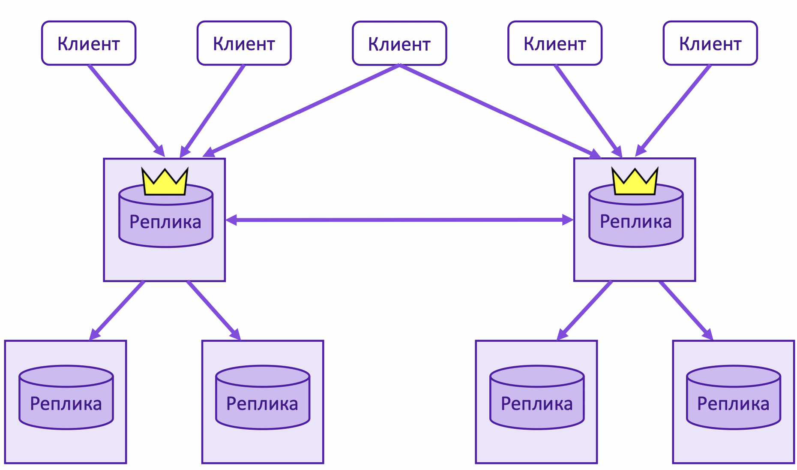
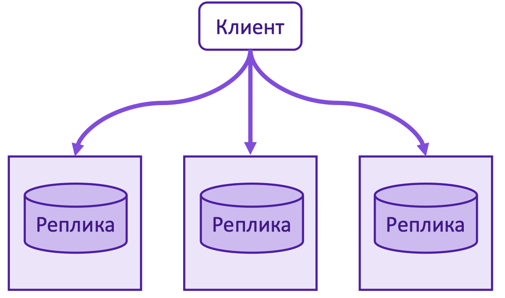
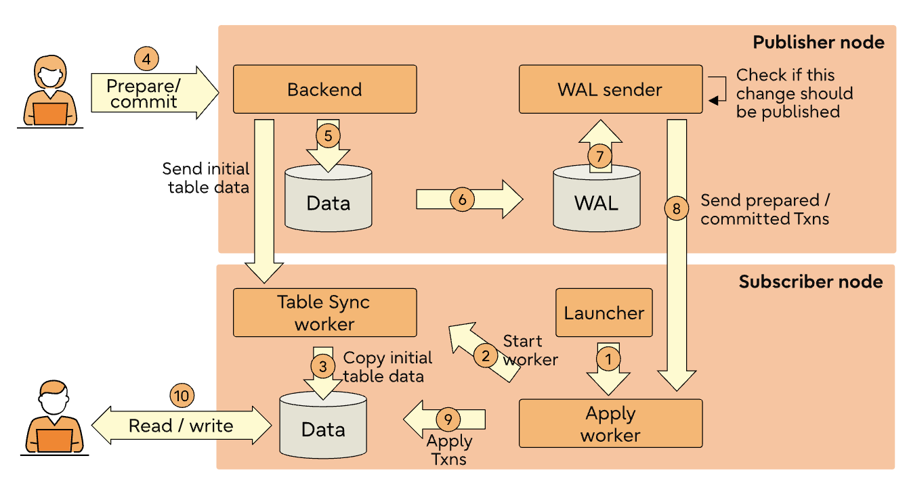
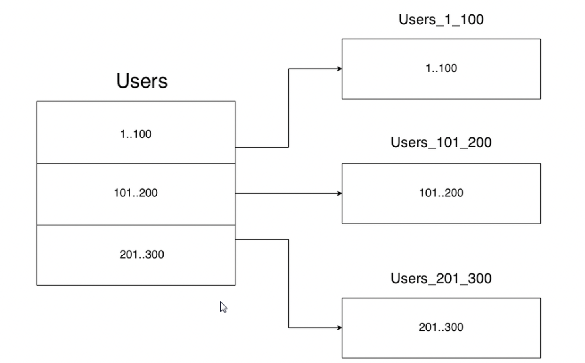

# 25.02.24 Методы повышения производительности и доступности баз данных через масштабирование на примере PostgreSQL

## Введение

В современном информационном мире, где базы данных играют ключевую роль в хранении и обработке огромного объема информации, эффективное управление данными становится все более важным. Масштабирование баз данных - это процесс, позволяющий адаптироваться к растущим потребностям и обеспечивать непрерывную работу системы даже при повышенной нагрузке.

Сегодня поговорим про три способа масштабирования БД на примере ___PostgreSQL___.:

* Репликация
* Партиционирование
* Шардирование

Далее будем считать, что ___партиционирование___ происходит в рамках одного сервера, а ___шардирование___ – в распределенной системе из нескольких узлов.

## Репликация
Репликация – это механизм копирования и поддержания в согласовании нескольких ___одинаковых___ наборов данных.
 


Мотивация:
* Обеспечение долговечности данных (больше одинаковых копий)
* Повышение доступности (при отказе реплики – все еще работаем)
* Увеличение производительности (балансируем запросы между репликами)

Обратите внимание на таблицу ниже. Она показывает зависимость вероятности отказа реплик от их числа, если, допустим, вероятность отказа одной реплики - 0.01. $$ P_i(j) = P_i(i >= j >= 1)= {i \choose j} * 0.01^j$$


Обычно репликация выдерживает потери нескольких реплик. Можем заметить, что в пределе вероятность отказа бОльшего числа реплик стремительно падает, что позволяет нам строить высоконадежные системы из реплик.

Недостатки:
* Требуется в N раз больше ресурсов для хранения данных
* Необходимо обеспечить согласованность данных

Выделение большого кол-ва ресурсов не столь критично в больших проектах, а обеспечение консистентности данных, напротив, становится узким местом.

Если мы говорми про неизменяемые данные (e.g. аудит, логи), то их репликация реализуется тривиально. Намного сложнее масштабировать работу с изменяемыми данными: нужно синхронизировать реплики и обеспечивать согласованность данных.

Выделяют две архитектурных модели репликации:
* пассивная – один выделенный сервер, обрабатывающий запросы клиентов и передающий изменения остальным.
* активная – серверы равноправны, запросы клиентов обрабатываются каждым сервером.



А также два способа реплицировать данные при пассиваной репликации:
* синхронный – когда клиент получает ответ после изменениях данных на всех репликах.
* ассинхронный – когда клиент получает ответ после записи на одну из реплик, далее реплики распространяют ответ в фоне.



Выделяют еще промежуточный способ репликации – полусинхронный, когда данные синхронно пишутся лишь на часть реплик.

Все архитектурные модели и способы репликации постоянно комбинируются, так как нет серебряной пули для решения всех задач. Поэтому появляются различные подходы.

Основные подходы к репликации:

* Репликация с одним лидером



* Репликация с несколькими лидерами



* Репликация без лидеров




### Репликация на примере PostgreSQL
---
Рассмотрим репликацию с одним лидером из коробки на примере PostgreSQL. Другие подходы к репликации можем встретить в иных системах. Так, например, CouchDB поддерживает multiple leader replication, а Cassandra, вовсе, leaderless.

PostgreSQL поддерживает из коробки логическую и физическую репликацию.

Физическая репликация построена на точных адресах блоков и побайтовом копировании, изменения на репликах передаются через WAL лидера.

Логическая репликация, напротив, не привязана к конкретному представлению данных на диске, а построена на работе с идентификаторами репликации по модели публикация-подписка.

Логическая репликация позволяет более детально управлять репликацией данных и аспектами безопасности.

Ниже можно увидеть архитектуру логической репликации для PostgreSQL 15.



### Логическая репликация на практике
---
Реализуем логическую репликацию на одном хосте с различными портами для лидера и реплики.

В конфигурации ```postgresql.сonf``` достаточно проставить ```wal_level = logical```, что указывают серверу сохранять дополнительную информацию о WAL.

Далее создадим публикацию с лидера, используя следующую команду.

```sql
CREATE PUBLICATION my_pub FOR ALL TABLES;
```

Как только публикация была создана, можно создавать подписки в узле подпсичиков.

```sql
CREATE SUBSCRIPTION my_sub&nbsp;
CONNECTION '<connection string>' PUBLICATION my_pub;
```

Это добавит новую подписку ```my_sub``` для текущей базы данных, которая начнет получать логические изменения из публикации ```my_pub```. 

Можете посмотреть функциональность логической репликации подробнее в документации [CREATE PUBLICATION](https://www.postgresql.org/docs/current/sql-createpublication.html) и [CREATE SUBSCRIPTION](https://www.postgresql.org/docs/current/sql-createsubscription.html).

## Партиционирование

Партиционирование – это процесс разделения таблиц или проколлекций документов на отдельные части в рамках одного сервера.

Каждая партиция, представляет собой отдельную таблицу, в которой хранится подмножество исходных данных. Этот метод может значительно повысить производительность запросов и управления данными для больших наборов данных.



Какие проблемы помогает решить партиционирование?

* ___Улучшенная производительность запросов___: Партиционирование позволяет БД быстро сузить объем данных до определенного раздела, уменьшая объем сканируемых данных.
Партиционирование по сути заменяет верхние уровни деревьев индексов, что увеличивает вероятность нахождения наиболее востребованных частей индексов в памяти.

* ___Упрощенное управление данными___: С помощью разбиения таблиц на разделы можно легко управлять большими наборами данных, разбивая их на более мелкие, более управляемые разделы. Это может упростить такие задачи, как архивирование данных, очистка данных.

* ___Улучшенная загрузка и индексация данных___: При загрузке данных в партиционированную таблицу процесс может быть распараллелен, что приводит к более быстрому получению данных. Кроме того, индексы в таких таблицах могут быть более эффективными, поскольку они должны охватывать только меньшее подмножество данных.

* ___Экономичное хранилище___: Разделение на части позволяет хранить более старые или менее используемые данные на более дешевых носителях, сохраняя при этом часто используемые данные на более быстрых устройствах.

Всё это обычно полезно только для очень больших таблиц. Как правило, следует применять для таблиц, размер которых превышает объём ОЗУ сервера.

Как можно сразу заметить, количество данных не уменьшается и, если неправильно выбирать критреии для разделения на партиции, можно сделать только хуже. Поэтому, если у вас кончается место на накопителе – партиционирование вряд ли поможет.

Чтобы партиционировать одну большую таблицу на несколько менее объемных – необходимо выбрать критерии деления.
